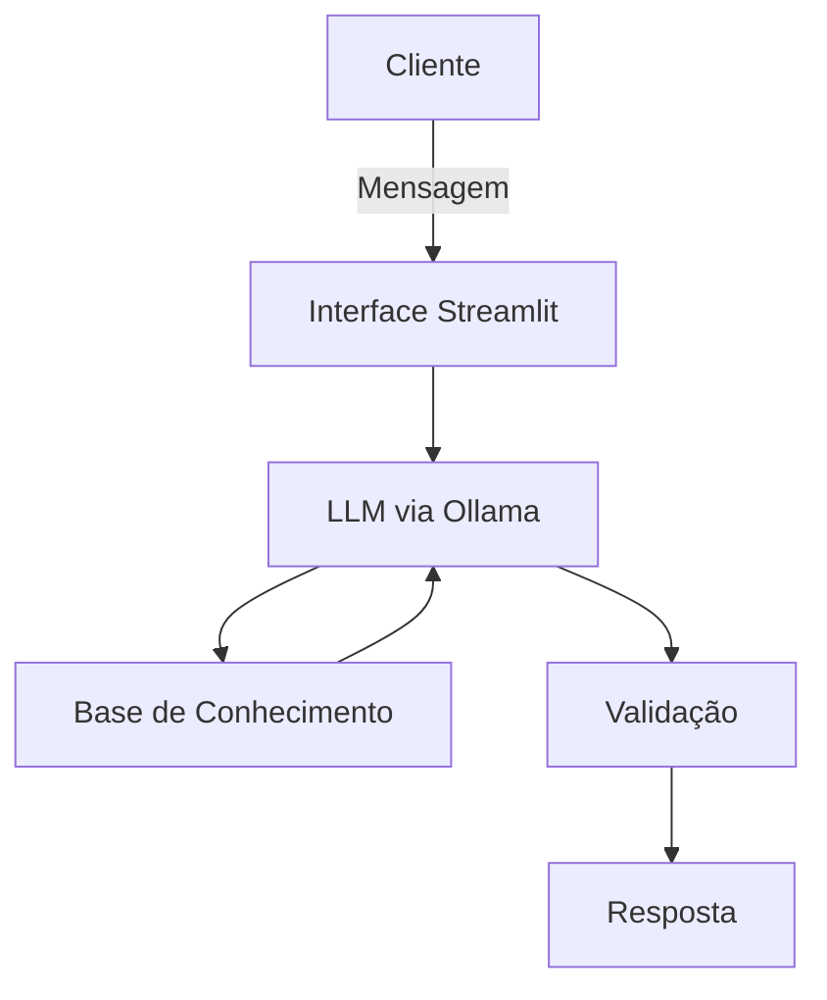

# 🤖 PoupeAI — Agente Financeiro Inteligente

Projeto desenvolvido no Lab **"Bia do Futuro" (DIO)**, que propõe idealizar e prototipar um agente financeiro com IA Generativa capaz de antecipar necessidades, personalizar sugestões e ajudar o usuário de forma consultiva e segura.

## Sobre o PoupeAI

O **PoupeAI** é um agente educador e auxiliar financeiro focado em ajudar pessoas que perdem o controle dos próprios gastos — evitando que parcelas acumuladas estourem o limite do cartão — e, quando solicitado, orientar a distribuição da carteira de investimentos sempre priorizando gastos essenciais (água, energia, aluguel, internet).

O agente roda **100% localmente** via [Ollama](https://ollama.ai/), sem exportar dados do usuário para serviços externos e sem custo de API.

### Principais características

- **Controle de gastos:** analisa transações e histórico de atendimento para responder sobre hábitos financeiros do usuário
- **Consultoria de investimentos:** sugere distribuição de carteira com base no perfil do investidor, só quando solicitado
- **Anti-alucinação:** respostas sempre baseadas nos dados fornecidos no contexto, nunca inventadas
- **Foco e segurança:** recusa perguntas fora do tema financeiro e nunca expõe dados sensíveis

---

## Arquitetura



| Componente | Descrição |
|------------|-----------|
| Interface | [Streamlit](https://streamlit.io) |
| LLM | [Ollama](https://ollama.ai/) (execução local) |
| Base de Conhecimento | Dados mockados em JSON/CSV |
| Validação | Checagem de coerência das respostas e cálculos |

---

## Estrutura do Repositório

```
📁 dio-lab-bia-do-futuro/
│
├── 📄 README.md
│
├── 📁 data/                          # Dados mockados usados pelo agente
│   ├── historico_atendimento.csv     # Histórico de atendimentos
│   ├── perfil_investidor.json        # Perfil e metas do cliente
│   ├── produtos_financeiros.json     # Produtos financeiros disponíveis
│   └── transacoes.csv                # Histórico de transações
│
├── 📁 docs/                          # Documentação do projeto
│   ├── 01-documentacao-agente.md     # Caso de uso, persona e arquitetura
│   ├── 02-base-conhecimento.md       # Estratégia de dados
│   ├── 03-prompts.md                 # System prompt e exemplos de interação
│   ├── 04-metricas.md                # Avaliação e métricas
│   └── 05-pitch.md                   # Roteiro do pitch
│
├── 📁 src/                           # Código da aplicação
│   └── app.py                        # Aplicação Streamlit do PoupeAI
│
├── 📁 assets/                        # Imagens, diagramas e roteiro do lab
│
└── 📁 examples/                      # Referências de implementação
```

---

## Como Executar

### Pré-requisitos

- Python 3.10+
- [Ollama](https://ollama.ai/) instalado e com um modelo baixado localmente

### Passos

```bash
# Instale as dependências
pip install streamlit pandas requests

# Suba o Ollama com o modelo desejado
ollama serve

# Ajuste a porta e o nome do modelo em src/app.py (OLLARAMA_URL e MODELO)

# Rode a aplicação
streamlit run src/app.py
```

---

## Documentação

| Documento | Conteúdo |
|-----------|----------|
| [`docs/01-documentacao-agente.md`](./docs/01-documentacao-agente.md) | Caso de uso, persona, tom de voz, arquitetura e segurança |
| [`docs/02-base-conhecimento.md`](./docs/02-base-conhecimento.md) | Como os dados são carregados e usados no contexto |
| [`docs/03-prompts.md`](./docs/03-prompts.md) | System prompt, exemplos de interação e edge cases |
| [`docs/04-metricas.md`](./docs/04-metricas.md) | Cenários de teste e avaliação de qualidade |
| [`docs/05-pitch.md`](./docs/05-pitch.md) | Roteiro do pitch de 3 minutos |

---

## Regras do Agente

1. Sempre baseia as respostas nos dados fornecidos
2. Nunca inventa informações financeiras
3. Admite quando não sabe algo e oferece alternativas
4. Nunca expõe dados sensíveis ou de outros usuários
5. Não abre arquivos suspeitos (`.bat`, `.ps1`, etc.)
6. Só recomenda investimentos alinhados ao perfil e à realidade do usuário
7. Não responde perguntas fora do tema financeiro

---

## Créditos

Projeto baseado no desafio **"Bia do Futuro"** da [Digital Innovation One (DIO)](https://www.dio.me/).
