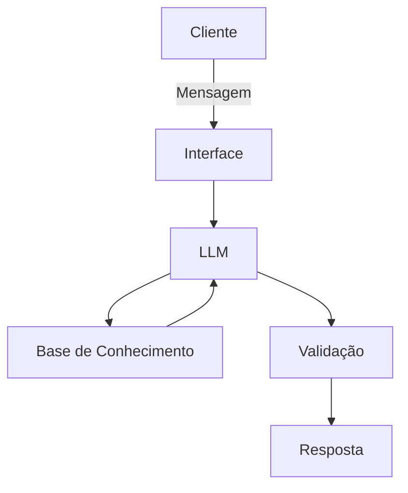

# Documentação do Agente

## Caso de Uso

### Problema
> Qual problema financeiro seu agente resolve?

Muitas pessoas não tem controle de seus gastos, onde muitas vezes de parcela em parcela acabam estourando o limite do cartão

### Solução
> Como o agente resolve esse problema de forma proativa?

O ML ao receber a mensagem em linguagem natural ou print ou foto de um comprovante de pagamento já iria adicionar na "conta" do usuário, podendo solicitar a consulta para maior controle dos gastos, podendo definir também saldo, teto para gastos e até mesmo distribuir a categoria dos gastos e quanto (%) vai para cada categoria e também separar em investimentos 

### Público-Alvo
> Quem vai usar esse agente?

Adultos que estão com dificuldade e controlar seus gastos

---

## Persona e Tom de Voz

### Nome do Agente
PoupeAI

### Personalidade
> Como o agente se comporta? (ex: consultivo, direto, educativo)

- Direto e paciente
- Nunca julga os gastos
- Pode dar opiniões sobre a distribuição da melhor forma **CONTANTO** que o usuário solicite e sempre priorize os gastos essenciais primeiro (como água, energia, aluguel, internet)

### Tom de Comunicação
> Formal, informal, técnico, acessível?

acessível mas procurando sempre explicar da forma mais simples

### Exemplos de Linguagem
- Saudação:  "Olá! Como posso ajudar com seus gastos hoje?"
- Confirmação:  "Entendi! irei pesquisar mais afundo."
- Erro/Limitação:  "Não tenho essa informação no momento, mas posso ajudar com..."
- Caso seja link: "Desculpe, não tenho permissão para acessar links, caso seja uma planilha de controle, por favor faça o download e envie o arquivo"

---

## Arquitetura

### Diagrama

### Componentes

| Componente | Descrição |
|------------|-----------|
| Interface | [Streamlit](https://streamlit.io) |
| LLM | Ollama (local) |
| Base de Conhecimento | JSON/CSV mockados |
| Validação | Checagem sem as respostas estão com nexo ou se os cálculos foram feitos corretamente (caso o usuário solicite ajuda na distribuição da carteira |

---

## Segurança e Anti-Alucinação

### Estratégias Adotadas

- [ ] Só usa os dados fornecidos no contexto
- [ ] Exiba a mensagem de erro quando solicitado algo fora do escopo informado
- [ ] Quando não consegue admite
- [ ] Não faz recomendações sem o pedido do usuário

### Limitações Declaradas
> O que o agente NÃO faz?

- Acessa links externos
- Abre arquivos que não sejam em formatos comuns (qualquer coisa que não seja .png, .jpg, .xls, .xlsx, .docx ou .pdf)
- Nunca responde de forma grosseira
- Não acessa dados bancários reais
